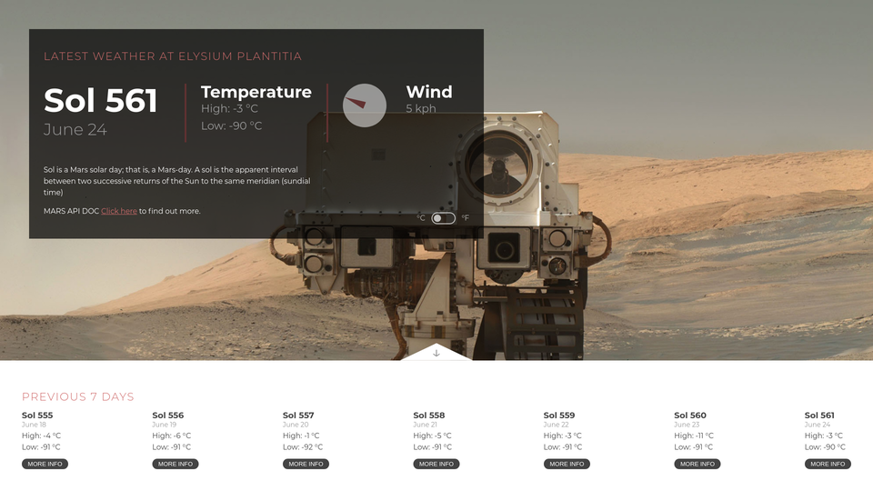

# MARS WEATHER 🪐

Always wanted to see MARS weather with a two days delay? ☄️ There you have it ! This app can show the weather on 'red planet' in metric/imperial system. Also shows the weather for the past 7 days.

### Prerequisites

This time you don't have to register API key 🗝️ 

```
const API_KEY = "DEMO_KEY";
```
this time NASA provided free API key

### Data
data get's pulled from this JSON

```
https://api.nasa.gov/insight_weather/?api_key=DEMO_KEY&feedtype=json&ver=1.0
```

### Installing

Download the project, and open index.html

## Image

